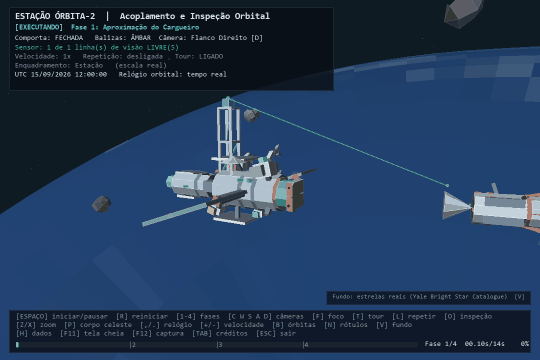
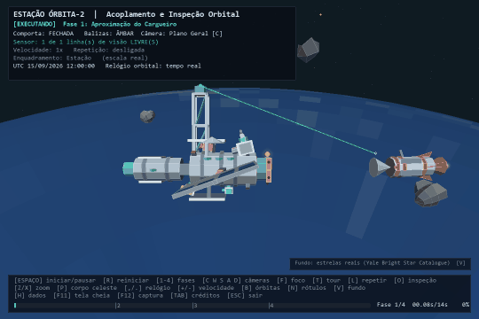
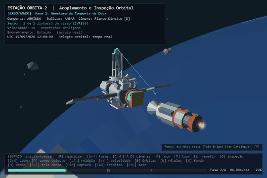
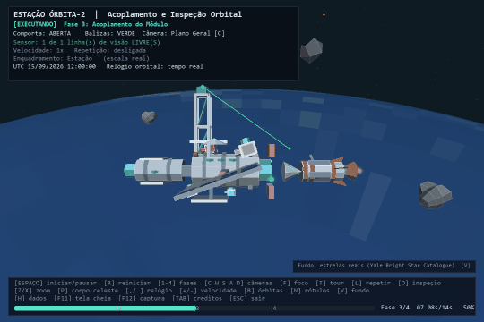
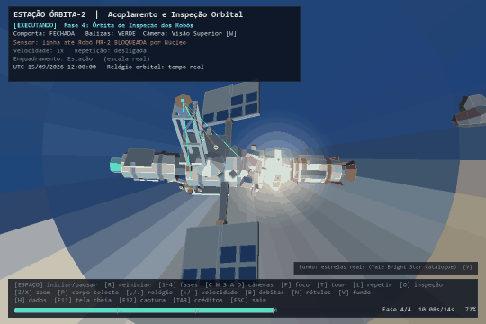
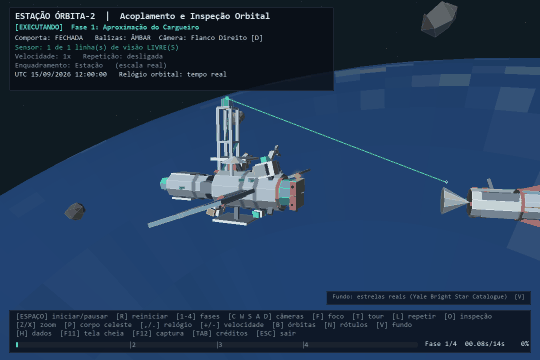
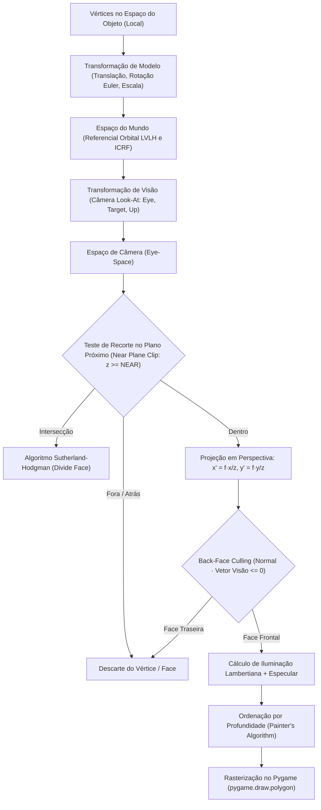

# Projeto AP1 — Computação Gráfica e RA/RV
## Estação Orbital Órbita-2: Mundo Virtual Animado em Pygame

[](https://www.python.org/)
[](https://pyga.me/)
[-orange.svg)]()
[-red.svg)]()
[]()

Ambiente tridimensional interativo e animado, desenvolvido inteiramente em **Python** e **Pygame**, sem auxílio de OpenGL, Vulkan, motores 3D ou bibliotecas matemáticas externas como `numpy` — atendendo a todas as restrições didáticas da disciplina de **Computação Gráfica e Realidade Aumentada / Realidade Virtual**.

Todo o pipeline gráfico — desde as transformações afins, câmera *look-at*, projeção em perspectiva analítica, *back-face culling*, recorte em plano próximo (*near-plane clipping*), ordenação por profundidade (*Painter's Algorithm*) e sombreamento Lambertiano com iluminação ambiente e realce especular — foi implementado do zero com matemática vetorial pura.

---

## 👥 Integrantes da Equipe

| Integrante | RA | Contribuição Principal |
|---|---|---|
| **Fellipe Augusto** | 2401525 | Coordenação, integração e testes |
| **Gabriel Muchon** | 2401895 | Modelagem geométrica e composição da cena |
| **Paloma Eduarda** | 2401660 | Animação e máquinas de estado finitas (FSM) |
| **Victor Wenzel** | 2401698 | Câmera, interface do usuário (HUD) e testes |

**Variação Temática:** Equipe 2 — *Estação Espacial* (acoplamento de módulos orbitais, trajetória orbital de robôs de manutenção com evitação de mastro, portas com máquina de estados e alerta sequencial de balizas).

---

## 🛰️ Demonstração Geral



A simulação retrata a estação orbital **Órbita-2** em órbita baixa da Terra recebendo a nave cargueira automatizada **Vega-7**. A cena completa conta com **32 malhas poligonais**, incluindo o núcleo com treliças estruturais, painéis solares articulados com rastreamento solar, comporta deslizante de doca, quatro robôs com braços mecânicos articulados, cinturão de detritos espaciais, satélites de telecomunicação e o Sistema Solar em escala astronômica real com dados orbitais efeméricos do JPL.

---

## 🚀 Como Executar

### Pré-requisitos
- Python 3.10 ou superior.
- Pygame (ou `pygame-ce` para Python 3.14).

```bash
# 1. Clone o repositório
git clone https://github.com/gblsun/space-station-pygame.git
cd space-station-pygame

# 2. Instale as dependências
pip install -r "Atividade AP1/requirements.txt"

# 3. Execute a aplicação
python "Atividade AP1/ap1.py"
```

> [!NOTE]
> No **Python 3.14**, utilize `pip install pygame-ce` (já configurado no `requirements.txt`), pois o Pygame tradicional não disponibiliza rodas pré-compiladas para esta versão.

---

## 🎮 Controles de Teclado

Todas as interações são **ações discretas disparadas por teclado**, conforme estipulado no enunciado acadêmico (sem controle contínuo por mouse ou física descontrolada):

| Tecla | Categoria | Ação |
|---|---|---|
| `ESPAÇO` | **Simulação** | Iniciar · pausar · retomar · reiniciar após conclusão |
| `R` | **Simulação** | Reiniciar a cena imediatamente para a pose inicial ($t = 0$) |
| `1`, `2`, `3`, `4` | **Fases** | Saltar diretamente para o início da Fase 1, 2, 3 ou 4 |
| `C` | **Câmera** | Câmera em Plano Geral (isométrica orbital) |
| `W` / `S` | **Câmera** | Câmera Superior (nadir) / Câmera Inferior (zênite) |
| `A` / `D` | **Câmera** | Flanco Esquerdo / Flanco Direito da estação |
| `F` | **Câmera** | Câmera de Foco Animado (persegue dinamicamente o cargueiro Vega-7) |
| `T` | **Câmera** | Modo Tour (alterna o enquadramento ideal a cada fase) |
| `Z` / `X` | **Zoom** | Aproximar / Afastar enquadramento (Doca $\rightarrow$ Estação $\rightarrow$ Órbita $\rightarrow$ Sistema Solar) |
| `+` / `-` | **Velocidade** | Ajustar velocidade do tempo da simulação (de $0{,}25\times$ a $3{,}0\times$) |
| `L` | **Execução** | Modo Loop contínuo (reinicia a sequência automaticamente) |
| `O` | **Inspeção** | Órbita de inspeção estendida (três voltas completas dos robôs) |
| `B` | **Exibição** | Alternar renderização dos traçados das órbitas |
| `N` | **Exibição** | Exibir/ocultar rótulos dos objetos (papéis do Requisito 3) |
| `H` | **Diagnóstico** | Painel de telemetria: FPS medido, contagem de faces, culling e tempo de quadro |
| `F12` | **Captura** | Salvar captura de tela em alta definição em `docs/img/` |
| `TAB` | **Créditos** | Exibir overlay de créditos da equipe e referências |
| `ESC` | **Sistema** | Encerrar a aplicação com liberação de recursos |

---

## 🎬 As 4 Fases da Simulação

A narrativa técnica da simulação é governada por uma **Máquina de Estados Finitos (FSM)** que divide os 14 segundos da animação em quatro fases rigorosamente sincronizadas:

### Fase 1: Aproximação e Alinhamento de Atitude (0 s – 4 s)


- **Dinâmica:** O cargueiro Vega-7 se desloca pelo eixo $+X$ em direção à doca de acoplamento da estação. Durante a trajetória, o sistema corrige o erro de atitude angular residual através de interpolação não linear (`smoothstep`), estabilizando a rotação antes de atingir o limiar da doca.
- **Sinalização Visual:** As seis balizas de alerta piscam em padrão âmbar sequencial de rodízio, indicando área de manobra ativa.
- **Estado da Doca:** Comporta firmemente `FECHADA`.

---

### Fase 2: Abertura da Doca e Propulsão Reversa (4 s – 7 s)


- **Dinâmica:** A comporta da doca executa sua FSM dedicada (`FECHADA` $\rightarrow$ `ABRINDO` $\rightarrow$ `ABERTA`), deslizando suas duas folhas poligonais em sentidos opostos ao longo do trilho.
- **Retrofoguetes:** O cargueiro inicia a manobra de desaceleração fina, disparando um emissor de partículas estocásticas de retrofoguete no sentido contrário ao movimento.
- **Deformação por Escala:** Uma pulsação harmônica suave de escala ($\pm 3\%$) é aplicada à malha da nave para simular a compressão estrutural da queima de propulsão.

---

### Fase 3: Acoplamento Físico e Travamento (7 s – 10 s)


- **Dinâmica:** A ponta do cargueiro penetra o colar de captura do anel de ancoragem da estação. Ao atingir o contato cinemático, um micro-tremor de câmera (*camera shake*) não acumulativo simula o engate mecânico.
- **Ciclo da Comporta:** A comporta faz a transição `FECHANDO` $\rightarrow$ `FECHADA`.
- **Confirmação:** As balizas de alerta mudam simultaneamente de âmbar pulsante para **verde estático**, indicando acoplamento estanque bem-sucedido.

---

### Fase 4: Órbita de Inspeção e Sensor de Linha de Visada (10 s – 14 s)


- **Dinâmica dos Robôs:** Os quatro robôs de manutenção (**MR-1** a **MR-4**), cada um com tamanho, cor, raio orbital e plano de inclinação distintos, desatracam e descrevem órbitas helicoidais de patrulha ao redor da estação, desviando do envelope de segurança da antena.
- **Cinemática Articulada:** Cada robô move independentemente os dois segmentos de seu braço mecânico articulado via transformações hierárquicas compostas.
- **Sensor de Linha de Visada (*Ray-Sphere*):** O sensor principal no topo da torre dispara raios em direção a cada robô:
  - 🟢 **Verde:** Linha de visada livre.
  - 🔴 **Vermelho:** Raio interceptado pela geometria do núcleo da estação ou pelo cinturão de detritos, marcando o ponto de impacto exato e identificando o obstáculo no HUD.

---

## 🎥 Sistema de Câmeras e Interpolação



O sistema de visualização foi projetado em torno de uma **câmera Look-At tridimensional**:
- **Base Ortonormal:** A cada quadro, a câmera reconstrói sua base vetorial ortonormal $(\vec{r}, \vec{u}, \vec{f})$ garantindo:
  $$\vec{f} = \frac{\vec{T} - \vec{E}}{\|\vec{T} - \vec{E}\|}, \quad \vec{r} = \frac{\vec{f} \times \vec{up}}{\|\vec{f} \times \vec{up}\|}, \quad \vec{u} = \vec{r} \times \vec{f}$$
- **Transição Suave (LERP Logarítmico):** Ao alternar entre presets de visualização (ex: Geral, Superior, Flancos), a câmera não efetua cortes secos; ela interpola suavemente a posição do olho e do alvo usando interpolação logarítmica de distância, tornando natural tanto o movimento a 40 metros da doca quanto o afastamento para a órbita da Terra.
- **Foco Animado (`F`):** Trava a âncora de alvo no cargueiro Vega-7, acompanhando dinamicamente sua trajetória em tempo real.

---

## ⚙️ Arquitetura do Pipeline Gráfico Analítico

O motor gráfico renderiza a cena tridimensional calculando cada transformação de forma analítica no processador:



### Fundamentos Matemáticos Implementados:
1. **Projeção em Perspectiva Analítica:**
   $$x_{screen} = x_c + \frac{f \cdot x_{cam}}{z_{cam}}, \quad y_{screen} = y_c - \frac{f \cdot y_{cam}}{z_{cam}}$$
2. **Back-Face Culling:**
   Elimina faces poligonais voltadas para longe do observador antes do preenchimento:
   $$\vec{N} = (\vec{v}_1 - \vec{v}_0) \times (\vec{v}_2 - \vec{v}_0), \quad \text{visível se } \vec{N} \cdot \vec{v}_0 < 0$$
3. **Iluminação Lambertiana com Luz de Preenchimento:**
   A intensidade de cor de cada face combina luz ambiente, componente difusa do Sol e luz de preenchimento refletida da Terra:
   $$I = I_{amb} + k_d \max(0, \vec{N} \cdot \vec{L}_{sol}) + k_{fill} \max(0, \vec{N} \cdot \vec{L}_{terra}) + k_s (\vec{R} \cdot \vec{V})^n$$
4. **Interseção Raio-Esfera (Traçado de Visibilidade):**
   Utilizada pelo sensor no topo da antena para testar oclusão:
   $$\|\vec{O} + t\vec{D} - \vec{C}\|^2 = R^2 \implies a t^2 + b t + c = 0$$

---

## ☀️ Efemérides Astronômicas e Órbitas Reais

Diferente de simulações estáticas convencionais, a estação orbita uma Terra com **relógio astronômico UTC real**:
- **Cálculo de Efemérides (`efemerides.py`):** Posições do Sol, planetas, Lua e asteroides calculadas por elementos orbitais keplerianos calibrados com as tabelas do **NASA/JPL Horizons**.
- **Referencial LVLH:** A estação translada orientando sua arfagem (*pitch*) ao vetor de velocidade orbital local.
- **Painéis Solares Inteligentes:** As juntas articuladas dos painéis solares calculam a cada quadro o produto vetorial em relação à direção do Sol, girando seus eixos para manter a máxima incidência energética solar perpendicular.

---

## 📋 Conformidade com os Requisitos da AP1

| # | Requisito Obrigatório do Enunciado | Implementação no Código (`ap1.py`) |
|---|---|---|
| **1** | Janela configurável, laço principal, FPS, $\Delta t$ e encerramento | `App.run()` com `clock.tick(60)`, `dt` suavizado e saída limpa via `ESC` ou fechamento da janela. |
| **2** | $\ge 3$ tipos de primitivas visuais | Polígonos (faces 3D), linhas (raios do sensor/órbitas), círculos (partículas e balizas), pontos (campo estelar), retângulos e textos rasterizados (HUD). |
| **3** | $\ge 5$ objetos: instâncias, sem partes e composto | **4 instâncias:** robôs MR-1 a MR-4 (escalas, cores e órbitas distintas). **Sem partes:** Terra e Lua (esferas puras). **Compostos:** Núcleo Órbita-2, Módulo Laboratório e Cargueiro Vega-7. |
| **4** | Translação, rotação e escala com variação | **Translação:** cargueiro, robôs e corpos celestes. **Rotação:** articulação dos braços, detritos e painéis. **Escala:** pulsação harmônica do cargueiro na Fase 2. |
| **5** | Câmera com $\ge 2$ modos alternados por tecla | Presets discretos (`C`, `W`, `S`, `A`, `D`), **Foco Animado** (`F`) centrado no cargueiro e **Modo Tour** (`T`). |
| **6** | $\ge 3$ animações distintas | Translação com interpolação não linear (aproximação do cargueiro), máquina de estados aninhada (`DoorFSM`) e trajetória sincronizada multi-objeto (robôs em órbita com evitação de mastro). |
| **7** | Comandos de teclado discretos documentados | Tratamento exclusivo de eventos `KEYDOWN` em `App.handle_event()`, sem comandos contínuos. |
| **8** | Interface sobreposta (HUD) informativa | Título, máquina de estados, fase ativa, temporizador, barra de progresso com marcos visuais e status dos sensores. |
| **9** | Recurso de visibilidade por traçado de raios | `Scene.line_of_sight()` calcula interseção analítica raio-esfera contra os detritos e o núcleo, alterando a cor do raio em caso de oclusão. |
| **10** | Tela de créditos e identificação | Acionada por `TAB`, exibindo os quatro integrantes, seus respectivos RAs, divisão de papéis e fontes bibliográficas. |

---

## 🧪 Testes Automatizados e Diagnóstico

O projeto inclui uma suíte completa de testes automatizados executáveis em ambiente *headless* (driver de vídeo `dummy` do SDL):

```bash
# Execução da suíte completa de testes unitários
python -m unittest discover -s "Atividade AP1" -p "test_*.py" -v

# Teste de fumaça (smoke test) de ponta a ponta com relatório de conformidade
python "Atividade AP1/test_ap1.py" --smoke

# Benchmark de performance do pipeline gráfico
python "Atividade AP1/test_ap1.py" --bench
```

### Orçamento de Performance
- **Meta:** 60 FPS estáveis ($\le 16{,}6\text{ ms}$ por quadro).
- **Tempo Médio Medido:** $\approx 11{,}2\text{ ms}$ a $13{,}5\text{ ms}$ por quadro em CPU convencional de uso geral, obtido através de otimizações de *frustum culling* com esferas envolventes e descarte prévio de faces traseiras.

---

## 📁 Estrutura do Repositório

```text
space-station-pygame/
├── Atividade AP1/              # Entrega acadêmica principal
│   ├── ap1.py                  # Motor gráfico 3D, FSM, cena e aplicação principal
│   ├── catalogo.py             # Parâmetros e dados físicos dos corpos celestes
│   ├── efemerides.py           # Mecânica celeste analítica e rotinas do JPL
│   ├── fontes_online.py        # Integração e consulta de dados astronômicos
│   ├── test_ap1.py             # Suíte de testes unitários, smoke e benchmark
│   ├── test_sistema_solar.py   # Validação astronômica do sistema solar
│   ├── requirements.txt        # Especificação de dependências
│   ├── Atividade-AP_1.pdf      # Enunciado oficial da disciplina
│   └── README.md               # Documento complementar do módulo acadêmico
├── docs/                       # Documentação técnica e entregas das etapas
│   ├── 01-proposta.md
│   ├── 02-esboco-da-cena.md
│   ├── 03-decisoes-tecnicas.md
│   ├── 04-roteiro-animacoes.md
│   ├── 05-roteiro-apresentacao.md
│   ├── gerar_figuras.py        # Gerador das figuras esquemáticas de apoio
│   └── img/                    # GIFs e diagramas visuais da documentação
│       ├── visao-geral.gif
│       ├── fase-1-aproximacao.gif
│       ├── fase-2-abertura-doca.gif
│       ├── fase-3-acoplamento.gif
│       ├── fase-4-inspecao-robos.gif
│       ├── camera-tour.gif
│       ├── esboco-planta.png
│       ├── fases.png
│       └── sistema-solar-hoje.png
└── Materiais de aula/          # Apostilas e exercícios da disciplina
```

---

## 📚 Referências Bibliográficas e Recursos
- **Aulas de Computação Gráfica:** Aulas 01 a 08 (Transformações geométricas 2D/3D, Projeção perspectiva, Pipeline gráfico, Câmeras sintéticas e Visibilidade).
- **Foley, J. D. et al.:** *Computer Graphics: Principles and Practice*. Addison-Wesley.
- **Shirley, P. & Marschner, S.:** *Fundamentals of Computer Graphics*. A K Peters / CRC Press.
- **NASA / JPL Horizons On-Line Ephemeris System:** Vetores de estado planetários e elementos orbitais keplerianos para validação celeste.
