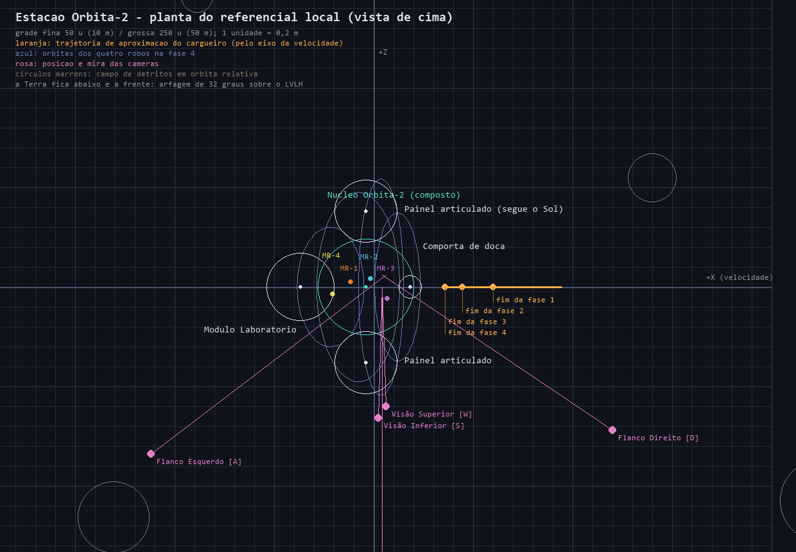
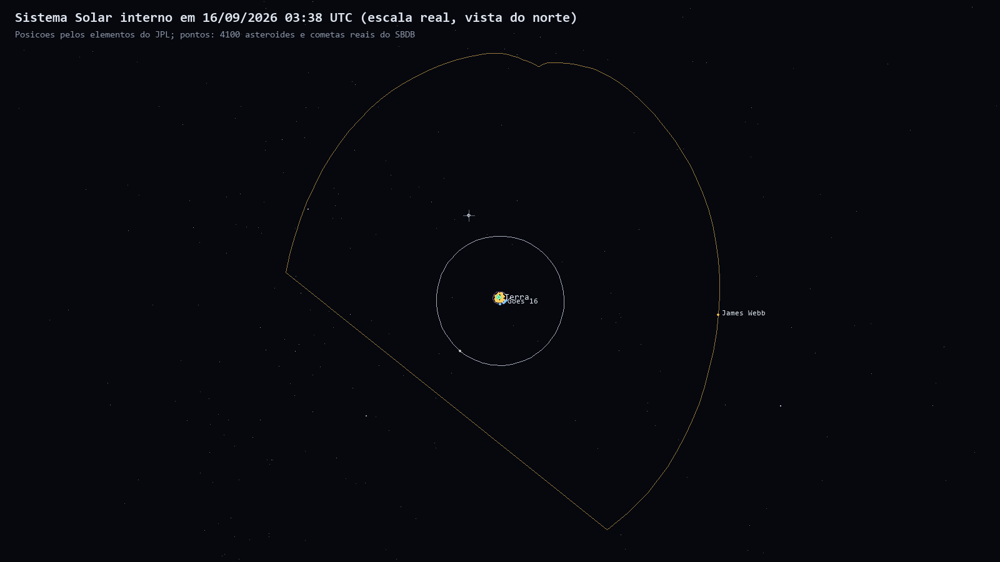
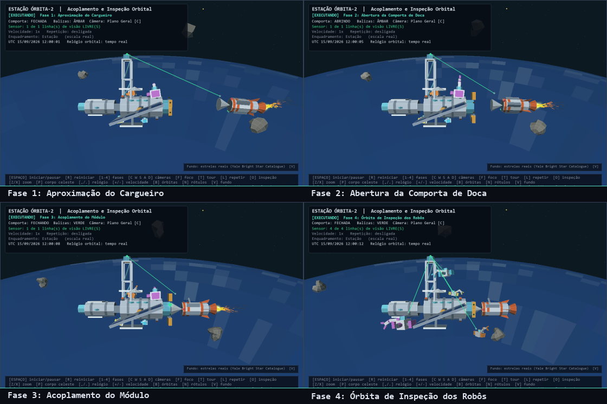

# Etapa 1 — Esboço da cena

As figuras deste documento são **geradas pelo próprio programa**
(`python docs/gerar_figuras.py`), de modo que nunca divergem do que a aplicação desenha.
Regere-as depois de qualquer mudança na cena.

## Planta do referencial da estação



A planta mostra, vista de cima, o **referencial local da estação** — o mesmo em que a
sequência é escrita. Como a Órbita-2 voa em atitude LVLH, essas posições valem em
qualquer ponto da órbita: a trajetória de aproximação do cargueiro com as marcas de fim
de fase, as órbitas dos quatro robôs, o campo de detritos, os painéis articulados e a
posição e mira de cada câmera.

## O Sistema Solar hoje



A mesma cena, afastada até o sistema interno, com os planetas na posição real do dia em
que a figura foi gerada e os milhares de asteroides do catálogo do JPL.

## As quatro fases



## Unidades e escala

A cena é **heliocêntrica e em escala real**:

| Grandeza | Valor |
|---|---|
| 1 unidade de mundo | 0,2 m (5.000 unidades por km) |
| Núcleo Órbita-2 | ~160 unidades de comprimento (~32 m), com painéis chegando a 100 m de ponta a ponta |
| Terra | 6.371 km de raio |
| Altitude da estação | 420 km, período de 92,9 minutos |
| Enquadramento mais distante | 190 UA, no Cinturão de Kuiper |

## Relações espaciais no referencial da estação

O eixo do casco é o **X**, alinhado com a velocidade orbital; **+Y** aponta para o
zênite, com uma arfagem fixa de 32° que mantém a Terra atrás e abaixo no plano geral.

```
      -X                         núcleo                        +X (velocidade)
   [cúpula][ Laboratório ]==túnel==[ casco Órbita-2 ]==[anel]==[ Vega-7 ]-->
                                        |     |
                            painéis articulados em ±Z
                                        |
                              treliça da antena em +Y
                            (sensor da linha de visão no topo)

                             a cabine fica DENTRO do casco:
                             corredor em X, cúpula no nadir
```

| Objeto | Posição (referencial da estação) | Observação |
|---|---|---|
| Núcleo Órbita-2 | `(0, 0, 0)` | pai de toda a hierarquia |
| Cabine | de `x = -96` a `x = 56`, raio 38 | interior habitável, com janelas |
| Módulo Laboratório | `(-184, 0, 0)` | filho do núcleo |
| Comportas | `(92, ±deslocamento, 0)` | filhas do núcleo; deslizam em Y |
| Balizas | anel de raio 38 em `x = 92` | seis, acesas em rodízio |
| Sensor da antena | `(-77, 208, 0)` | origem dos raios de visibilidade |
| Painéis solares | juntas em `(-20, 0, ±128)` | giram em torno do mastro, seguindo o Sol |
| Cargueiro Vega-7 | `x` de 470 a 178 | aproxima-se ao longo de X |
| Robôs MR-1 a MR-4 | ancorados no casco; órbitas de raio 150 a 272 | saem na fase 4 |
| Campo de detritos | órbitas relativas de raio 760 a 1.950 | bloqueiam o sensor |

## Hierarquia de transformações

Quatro níveis, compostos por multiplicação de matrizes:

```
Sol (origem do mundo)
 └── Terra (posição e rotação reais)
      └── Órbita-2 (órbita real + atitude LVLH + arfagem)
           ├── cabine, laboratório, comportas, balizas e detritos
           ├── painel solar  → junta do mastro (segue o Sol)
           ├── cargueiro     → atitude própria durante a manobra
           └── robô MR-n     → braço → antebraço → garra
```

Os satélites reais repetem o padrão: `Terra → nave (atitude do modelo) → junta → painel`.
A ISS tem duas juntas por asa — a da treliça e a da própria asa —, exatamente como a de
verdade.

## Enquadramentos

Dez níveis, alternados por `Z` e `X`:

| Nível | Distância | O que mostra |
|---|---|---|
| Cabine | dentro do módulo | corredor, cúpula, bancada e os dois visores |
| Doca | 40 m | a comporta e o encaixe do cargueiro |
| Estação | 140 m | a estação inteira |
| Vizinhança | 3 km | a estação e o campo de detritos |
| Órbita baixa | 2.600 km | a estação sobre a curvatura da Terra |
| Terra e satélites | 160.000 km | a Terra com as constelações de satélites |
| Terra, Lua e L2 | 2,9 milhões de km | a órbita da Lua e o James Webb |
| Sistema interno | 4,2 UA | do Sol a Marte, com o cinturão de asteroides |
| Sistema Solar | 68 UA | os oito planetas |
| Kuiper e além | 190 UA | planetas anões e cometas |

A tecla `P` sai desse eixo e foca qualquer corpo diretamente, do Sol a Hale-Bopp.
